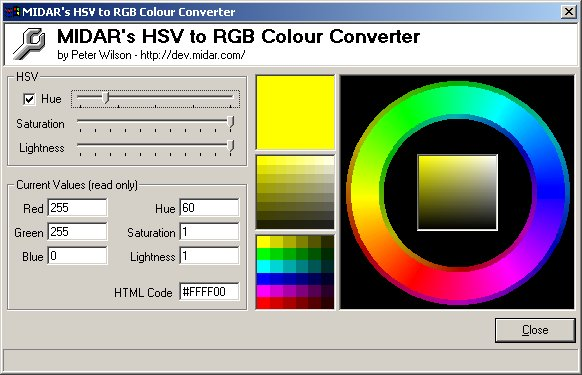

## RGB Colour Wheel

### Description

You may never again want to use VB's internal RGB function, after seeing how much simpler and better this HSV function is. Use the full colour spectrum in new and exciting ways, that are simply difficult (if not impossible) using VB's internal RGB function. It saddens me to realize that Microsoft programmers could have easily placed this routine into VB, but didn't. I wonder if this functionality is even in .NET yet? Anyone?
 
### More Info
 

             |
---                |---
**Submitted On**   |2003-07-21 12:03:30
**By**             |[Peter Wilson](https://github.com/Planet-Source-Code/PSCIndex/blob/master/ByAuthor/peter-wilson.md)
**Level**          |Beginner
**User Rating**    |4.5 (18 globes from 4 users)
**Compatibility**  |VB 6\.0
**Category**       |[Graphics](https://github.com/Planet-Source-Code/PSCIndex/blob/master/ByCategory/graphics__1-46.md)
**World**          |[Visual Basic](https://github.com/Planet-Source-Code/PSCIndex/blob/master/ByWorld/visual-basic.md)
**Archive File**   |[RGB\_Colour1618447212003\.zip](https://github.com/Planet-Source-Code/peter-wilson-rgb-colour-wheel__1-47055/archive/master.zip)

